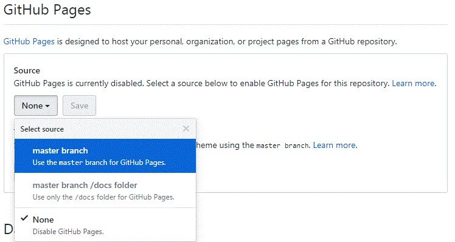

# 新手村作業  

## Lv. 3  

* Bootstrap裝飾網頁  
  Sep-14-2018  

## Lv. 2  

* 年齡計算Javascript  
  Sep-07-2018 debug  
  Sep-08-2018 將JavaScript由內嵌改為引用js檔  
  jQuery年齡計算  
  Sep-17-2018 Datepicker好省事

* RoR Hello World初體驗  
  Sep-05-2018  

* CSS裝飾網頁  
  Sep-07-2018  

* 設置Github pages  
  Sep-07-2018  
  
---
  有個方便管理、不用另開專案的方法是：
  1. 進入在GitHub放作業的Repositories頁面  
  2. 選擇Settings分頁  
  3. 往下拉到GitHub Pages段落，  
     將Source由None改為master branch，儲存  
       
  4. 之後就可以直接用下面的網址交作業：  
     `https://帳號.github.io/放作業的專案名/檔案名.副檔名`   
---
  
## Lv. 1  

* 純HTML網頁  
  Sep-04-2018  

* 以Markdown語言做相同的事  
  Sep-04-2018  

* 在Linux(Ubuntu)上安裝Ruby & Rails環境  
  Sep-04-2018  

* 完成Ruby的“Hello World”初體驗  
  Sep-04-2018  

### 支線  

* 3個CSS小遊戲通關  
  Sep-01-2018  

## Lv. 0  

* 擁有一個Github帳號  
  Aug-25-2018  

* 登入練習機  
  Aug-29-2018  

* 認識環境：編輯器  
  Aug-30-2018  
  Sublime 3 課程完成  

* 排定唸書時間  
  Aug-30-2018  